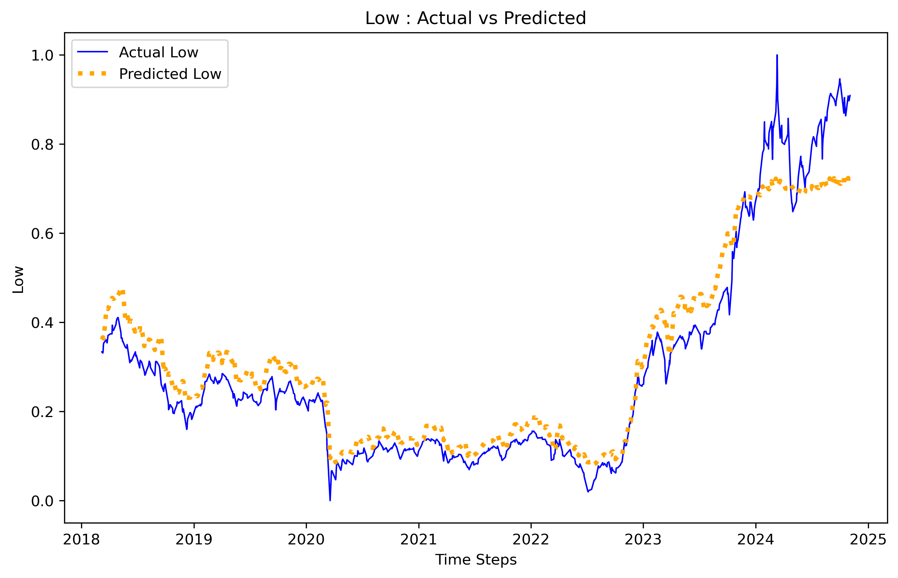

# Stock Price Prediction Using Modified Transformer Architecture

This repository contains the implementation of a stock price prediction model using Transformer-based architecture. The model takes historical stock data as input and predicts future stock prices, specifically the **OHLC (Open, High, Low, Close)** prices, for a given period of time.

The project involves several components:
- **Data Processing**: Cleaning and preparing the stock data for training.
- **Model Architecture**: A Transformer-based architecture for forecasting future prices.
- **Training & Evaluation**: Training the model using the processed data and evaluating its performance.
- **Inference & Visualization**: Running the trained model on unseen data and visualizing the results (actual vs. predicted prices).

## Table of Contents
1. [Project Overview](#project-overview)
2. [Setup and Installation](#setup-and-installation)
3. [File Structure](#file-structure)
4. [Data Preprocessing](#data-preprocessing)
5. [Model Architecture](#model-architecture)
6. [Training](#training)
7. [Inference and Visualization](#inference-and-visualization)
8. [Config File](#config-file)
9. [License](#license)

## Project Overview

The primary objective of this project is to predict stock prices using a **Transformer-based model**. The model is designed to take in a sequence of historical stock prices and predict the future prices (OHLC values) for a given number of days ahead.

### Key Components:
- **Feature Set**: The model uses the historical stock prices (OHLC) as input features for prediction.
- **Transformer Architecture**: The model is based on the Transformer architecture, which has shown great success in sequence modeling tasks.
- **Training**: The model is trained on historical stock data, learning patterns and dependencies over time.
- **Prediction**: Once trained, the model generates predictions for future stock prices based on the historical input.

### Input and Output:
- **Input**: A sequence of historical stock prices (OHLC) for a given number of past days.
- **Output**: Predicted stock prices (OHLC) for the next `n` days.

---

## Setup and Installation

### Prerequisites

To run the code, ensure you have the following dependencies installed:
- **Python 3.x** (Preferably Python 3.7+)
- **PyTorch** (For model training and inference)
- **Pandas** (For data manipulation)
- **NumPy** (For numerical operations)
- **Matplotlib** (For visualization)
- **Scikit-learn** (For additional utilities like train-test split)

### Installation

1. **Clone the repository**:
   ```bash
   git clone https://github.com/Ahmedh12/OHLC-Prices-Predictor.git
   cd "stock Price Predictor"
   ```

2. **Create a virtual environment** (recommended):
   ```bash
   conda create --name <env> --file requirments.txt
   conda activate <env>
   ```
---

## File Structure

The directory structure of the project is as follows:

```
Stock Price Predictor/
│
├── config/                   # Configuration files
│   ├── __init__.py           # Initialization file for the config package
│   ├── config_1.json         # JSON file for model configuration
│   └── utils.py              # Utility functions for config handling
│
├── data/                     # Data processing scripts and folders
│   ├── processed/            # Cleaned and processed stock data
│   ├── raw/                  # Raw stock data
│   ├── __init__.py           # Initialization file for the data package
│   ├── data_loader.py        # Script to load stock data
│   └── preprocess.py         # Script for preprocessing data
│
├── models/                   # Model definition files
│   ├── transformer/          # Transformer model components
│   │   ├── __init__.py       # Initialization file for transformer package
│   │   ├── attention.py      # Attention mechanism implementation
│   │   ├── decoder.py        # Decoder implementation for the model
│   │   ├── encoder.py        # Encoder implementation for the model
│   │   ├── feedforward.py    # Feedforward network used in the transformer
│   │   └── utils.py          # Utility functions for transformer model
│   ├── stock_predictor.py    # Main model for stock prediction
│
├── notebooks/                 # Jupyter notebooks for data exploration and model verification
│   ├── Data Exploration.ipynb
│   └── model_verification.ipynb
│
├── scripts/                   # Scripts for training, inference, and visualization
│   ├── __init__.py           # Initialization file for scripts package
│   ├── train_stock_predictor.py # Script to train the model
│
├── tests/                        # Unit tests for the project
│   ├── __init__.py               # Initialization file for tests package
|   ├── test_attention.py         # test cases to test transformer's attention
|   ├── test_data_loader.py       # test cases to test data loader
|   ├── test_decoder.py           # test cases to test transformer's decoder
|   ├── test_encoder.py           # test cases to test transformer's encoder
|   ├── test_feedforward.py       # test cases to test transformer's feedforward
│   └── test_stock_predictor.py   # test cases to test stock predictor transformer
│
├── utils/                     # Utility functions for various tasks
│   ├── __init__.py           # Initialization file for utils package
│   └── visualizer.py         # Visualization functions for plotting results
│
├── weights/                   # Saved model weights after training
│
├── .gitignore                 # Git ignore file for unwanted files
├── README.md                  # Project documentation
└── requirements.txt           # List of required Python packages
```

---

## Data Preprocessing

The project uses historical stock data (OHLC values) for training the model. The raw data is first cleaned and preprocessed into a format suitable for input to the model.

### Preprocessing Steps:
1. **Loading the Data**: Stock data (OHLC) is loaded from CSV files.
2. **Cleaning**: Missing values, outliers, and irrelevant columns are removed.
3. **Normalization**: Data is normalized or standardized to ensure consistent scale.
4. **Data Splitting**: The data is split into training and test datasets. A sliding window approach is often used for time-series data.
5. **Sequence Creation**: Sequences of past stock prices (e.g., 30 days) are created as input features for the model.

The preprocessing steps are handled in the `preprocess.py` file.

---

## Model Architecture

The model is built on a slightly modified **Transformer** architecture, which is well-suited for sequence-based tasks.

### Parameters:
- `feature_dim`: Number of features for each time step (e.g., 4: OHLC).
- `embed_dim`: Dimension of the input embeddings.
- `seq_len_past`: Number of past days to use as input (e.g., 30 days).
- `seq_len_future`: Number of future days to predict (e.g., 5 days).
- `num_heads`: Number of attention heads in the transformer model.
- `num_layers`: Number of layers in the transformer encoder.
- `ff_dim`: Dimension of the feedforward layer.
- `dropout`: Dropout rate to prevent overfitting.

The model is implemented in `stock_predictor.py` and consists of an encoder-decoder architecture, where the encoder processes the past stock data, and the decoder generates future price predictions.

---

## Training

### Training Procedure

1. **Prepare Data**: Use the preprocessed data from the `data/processed` folder to create training and validation datasets.
2. **Define Model**: Initialize the Transformer model with the desired hyperparameters.
3. **Train Model**: Train the model using the `train.py` script. During training, the model learns to map sequences of historical stock prices to future prices.
4. **Save Model**: After training, the model weights are saved to disk for later inference.

### Command to Train the Model:
```bash
python scripts/train_stock_predictor.py <learning_rate> <num_epochs> <model_config_id>
```

---

## Inference and Visualization

Once the model is trained, you can use it to predict future stock prices based on new input data.

### Inference

Run the inference script (`visualizer.py`) to generate predictions from the trained model. This script takes a sequence of historical stock prices and predicts the future prices.


## Config File

The model parameters (e.g., `feature_dim`, `embed_dim`, `seq_len_past`, etc.) are stored in a JSON configuration file `model_config.json` in the `config` folder. You can modify this file to adjust the hyperparameters and model settings.

Example of `model_config.json`:
```json
{
    "feature_dim": 4,
    "embed_dim": 64,
    "seq_len_past": 5,
    "seq_len_future": 5,
    "num_heads": 4,
    "num_layers": 1,
    "ff_dim": 128,
    "dropout": 0.1
}
```
## Model Evaluation 

The model was evaluated using historical **EGX30** data spanning from **01-Mar-2018** to **28-Nov-2024**. This dataset was used to assess the model's ability to predict key stock metrics such as **Price**, **Open**, **High**, and **Low**.

### Plots (Actual Vs. Predicted)

| Close                        | Open                       |
|------------------------------|-----------------------------|
|  |  |

| High                  | Low                        |
|----------------------------|----------------------------|
|  |  |

### Metrics
The table below provides the evaluation metrics for the model predictions across different features (Close, Open, High, Low):

| Metric                         | Close  | Open    | High    | Low     |
|--------------------------------|--------|---------|---------|---------|
| **Mean Absolute Error (MAE)**  | 0.0740 | 0.0400  | 0.0569  | 0.0329  |
| **Mean Squared Error (MSE)**   | 0.0108 | 0.0025  | 0.0043  | 0.0026  |
| **Root Mean Squared Error (RMSE)** | 0.1038 | 0.0502  | 0.0658  | 0.0507  |
| **R-squared (R²)**             | 0.8150 | 0.9565  | 0.9214  | 0.9543  |

#### Key Notes:
- **MAE (Mean Absolute Error):** Indicates the average magnitude of errors in predictions.
- **MSE (Mean Squared Error):** Measures the average of squared differences between predicted and actual values.
- **RMSE (Root Mean Squared Error):** The square root of MSE, providing errors in the same unit as the target variable.
- **R² (R-squared):** Explains the proportion of variance in the dependent variable that is predictable from the independent variable.
  
## License

This project is licensed under the MIT License - see the [LICENSE](LICENSE) file for details.

---
